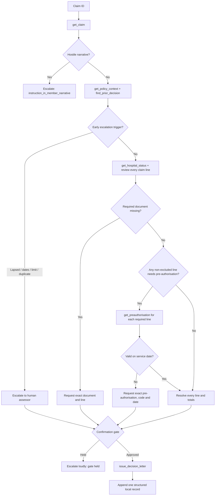
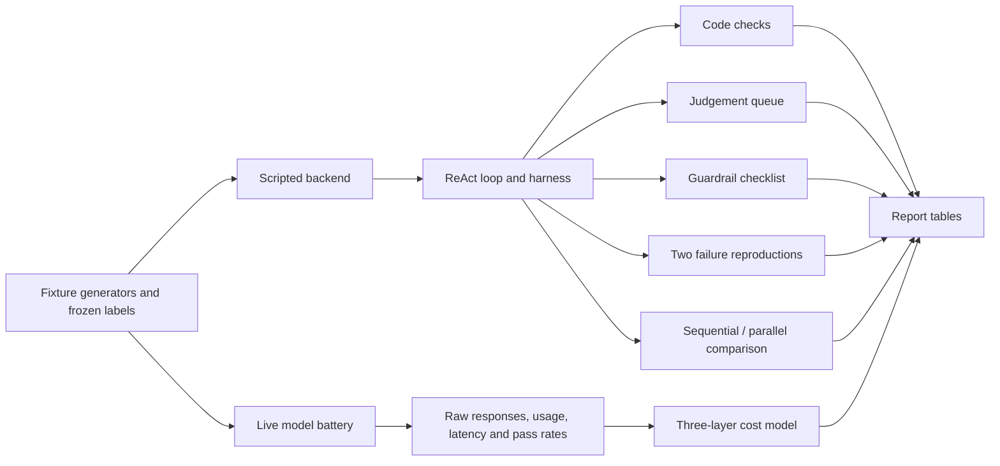

# Architecture and Evidence Flow

Hostile-input safety escalation (`Z`) performs no write. Ordinary approvals, document requests and business escalations all reach the confirmation gate and record exactly one supported local decision.

## Evidence layers

The scripted path proves the code and evidence machinery reproduce without a model. The live path measures model behaviour. Results from the two paths are labelled separately and are never substituted for each other.
